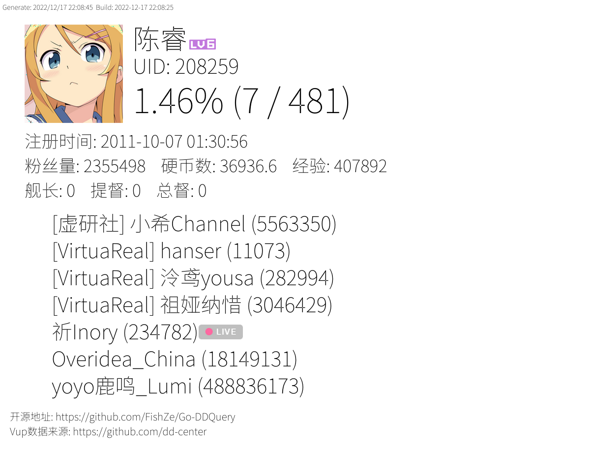

# Go-DDQuery

### Go语言的Bilibili的DD成分查询

- [x] 通过UID查询
- [x] 通过用户名查询
- [x] 显示所有大航海数据
- [x] 显示直播中的主播
- [x] 通过`HTTP`接口查询, 支持其他`BOT`调用



### 使用方法:

1. 直接在命令行使用
```go
package main

import (
    "fmt"
	"os/exec"
	"strconv"
	"github.com/FishZe/Go-DDQuery"
)

func main() {
	var input string
	fmt.Println("请输入要查询的昵称或UID (如: 陈睿 / UID: 1):")
	_, err := fmt.Scanln(&input)
	if err != nil {
		return
	}
	var uid int64
	var name string
	if len(input) > 4 && (input[:4] == "UID:" || input[:4] == "uid:") {
		input = input[4:]
		uid, err = strconv.ParseInt(input, 10, 64)
		if err != nil {
			fmt.Println("输入的UID格式错误")
			return
		}
	} else {
		name = input
	}
	route, err := Go_DDQuery.DDQuery(name, uid)
	if err != nil {
		fmt.Println(err)
		return
	}
	fmt.Println(route)
	cmd := exec.Command("cmd", "/k", "start", route)
	err = cmd.Start()
	if err != nil {
		return
	}
}
```
2. 和`Gin`一起使用
```go
package main

import (
	"github.com/FishZe/Go-DDQuery"
	"github.com/gin-gonic/gin"
	"net/http"
	"os"
	"strconv"
)

func main() {
	gin.SetMode(gin.ReleaseMode)
	r := gin.Default()
	r.GET("/query", func(c *gin.Context) {
		if c.Query("uid") == "" && c.Query("name") == "" {
			c.JSON(http.StatusOK, gin.H{
				"error": "uid or name is required",
			})
			return
		}
		var uid int64
		var name string
		if c.Query("uid") != "" {
			uid, _ = strconv.ParseInt(c.Query("uid"), 10, 64)
		} else {
			name = c.Query("name")
		}
		route, err := Go_DDQuery.DDQuery(name, uid)
		if err != nil {
			c.JSON(http.StatusOK, gin.H{
				"error": err.Error(),
			})
			return
		}
		if c.Query("show") == "1" {
			file, _ := os.ReadFile(route)
			_, err2 := c.Writer.WriteString(string(file))
			if err2 != nil {
				c.JSON(http.StatusOK, gin.H{
					"error": err2.Error(),
				})
				return
			}
		} else {
			c.JSON(http.StatusOK, gin.H{
				"route": route,
				"error": nil,
			})
		}
	})
	err := r.Run()
	if err != nil {
		return
	}
}

```
